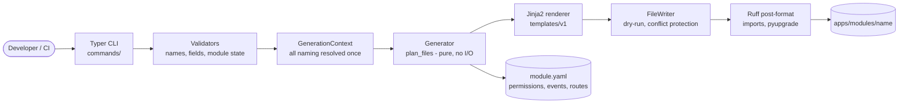
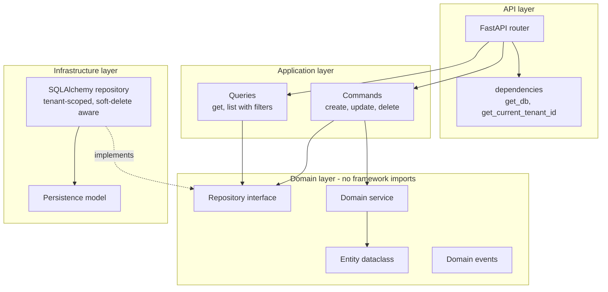

# zynkoh-cli — Code Generator for Clean Architecture FastAPI Modules in Multi-Tenant SaaS

[](https://github.com/shivkumarsinghsky/zynkoh-cli/actions/workflows/ci.yml)


A developer CLI by **Shiv Kumar** that generates architecture-compliant code for a modular,
multi-tenant SaaS backend: bounded-context modules, domain entities, vertical-slice features and
complete CRUD resources built on **FastAPI**, **SQLAlchemy 2 (async)** and **Pydantic v2**.

It exists so a small team can grow a large modular monolith, one that can later be split into
microservices, without hand-writing the same folder layout, repository boilerplate and API
wiring for every resource. Every generated module follows the same Clean / Hexagonal
architecture rules, so there is no drift between what one developer writes by hand and what
another generates.

```bash
zynkoh create module eam
zynkoh create crud asset --module eam --fields "code:str,name:str,purchase_cost:decimal?,installed_on:date?"
```

This produces a runnable FastAPI module with tenant-scoped repositories, soft delete, audit
fields, domain events, capability-based permission constants, allowlisted filtering and
sorting, and tests. The generated code passes its own `ruff` rules and test suite; this
repository's end-to-end tests generate a module and exercise its API against a database on
every CI run.

## Contents

- [Key features](#key-features)
- [Architecture](#architecture)
- [Installation](#installation)
- [Quick start](#quick-start)
- [Commands](#commands)
- [Architecture rules the generator enforces](#architecture-rules-the-generator-enforces)
- [What gets generated](#what-gets-generated)
- [Template system](#template-system)
- [Project structure](#project-structure)
- [Development](#development)
- [Docker](#docker)
- [Design decisions](#design-decisions)
- [Known limitations](#known-limitations)
- [Related Projects](#related-projects)
- [Author](#author) · [License](#license)

## Key features

- **Four generators:** `module`, `entity`, `feature` (vertical slice) and `crud` (feature plus filtering, sorting and pagination).
- **Tenant isolation by construction:** every repository method requires `tenant_id`; there is no unscoped query to call.
- **Safe dynamic queries:** filter and sort fields are checked against a generated allowlist; column names never come from user input.
- **Correct type mapping:** `decimal` → `Numeric`/`Decimal`, `date` → `Date`, `json` → `JSON`, and so on through domain, schema, persistence and query layers.
- **Pure planning, safe writing:** generators compute a plan without touching disk, so `--dry-run` is a true preview and existing files are never overwritten silently.
- **Lint-clean output:** generated Python is import-sorted and modernised with Ruff after rendering.
- **Versioned templates:** modules record the template version they were generated with, so a CLI upgrade never changes existing modules silently.

## Architecture



The CLI itself is layered: `commands/` only parses input and reports results, `generators/`
decide *what* to render *where*, and `templates/` are purely declarative. A generator's
`plan_files()` returns a list of (template, output path) pairs without side effects, which
makes generators testable in isolation.

The code it generates follows a hexagonal layout:



Full details, including the request flow and transaction boundary, are in
[docs/architecture.md](docs/architecture.md).

## Installation

Requires Python 3.12+ and [uv](https://docs.astral.sh/uv/).

```bash
# Global tool install (isolated environment)
uv tool install "git+https://github.com/shivkumarsinghsky/zynkoh-cli.git"
zynkoh --help

# Pin a release, recommended for CI so generated output cannot change mid-pipeline
uv tool install "git+https://github.com/shivkumarsinghsky/zynkoh-cli.git@v1.1.0"

# Upgrade / uninstall
uv tool upgrade zynkoh-cli
uv tool uninstall zynkoh-cli
```

## Quick start

Run `zynkoh` from the root of the backend repository you are generating into (the directory
that contains, or will contain, `apps/modules/`).

```bash
# A bounded-context module
zynkoh create module eam

# A domain entity only (no API)
zynkoh create entity location --module eam

# A vertical slice with fields
zynkoh create feature work-order --module eam \
  --fields "asset_id:uuid,description:text,status:str,scheduled_date:date?"

# Full CRUD with filtering, sorting and pagination
zynkoh create crud asset --module eam \
  --fields "code:str,name:str,category:str,serial_number:str?,purchase_cost:decimal?"

# Preview without writing anything
zynkoh create crud invoice --module crm --fields "amount:decimal,status:str" --dry-run
```

Run any `create` command without a name to be prompted for every option interactively.

Then run the generated module:

```bash
cd apps/modules/eam
uv venv && source .venv/bin/activate
uv pip install -e ".[dev]"
uvicorn app.main:app --reload     # http://127.0.0.1:8000/docs
```

Before the CRUD endpoints can persist data, wire `get_db()` in `app/api/dependencies.py` to
your session factory (see [Known limitations](#known-limitations)).

## Commands

| Command | Produces |
|---|---|
| `zynkoh create module <name>` | A runnable bounded-context module skeleton |
| `zynkoh create entity <name> --module <module>` | A domain entity and repository interface, no API |
| `zynkoh create feature <name> --module <module>` | A vertical slice: domain, application, infrastructure, API, tests |
| `zynkoh create crud <name> --module <module> --fields "..."` | `feature` plus filtering, sorting and pagination |

| Flag | Applies to | Effect |
|---|---|---|
| `--dry-run` | all | Show what would be generated without writing |
| `--force` | all | Overwrite existing files (off by default; conflicts are never silent) |
| `--tenant-aware / --no-tenant-aware` | `module`, `entity` | Tenant scoping (default on). `feature` and `crud` are always tenant-scoped, see [ADR-002](docs/decisions/ADR-002-mandatory-tenant-scoping.md) |
| `--modules-root` | all | Where modules live (default `./apps/modules`) |
| `--fields "name:type,name:type?"` | `feature`, `crud` | Field definitions; append `?` for nullable. Required for `crud` |
| `--soft-delete / --no-soft-delete` | `feature`, `crud` | Soft-delete columns and behaviour (default on) |

Field types and how they map through the layers:

| `--fields` type | Domain / schema | Database column | List filter param |
|---|---|---|---|
| `str` | `str` | `String(255)` | `str` |
| `text` | `str` | `Text` | `str` |
| `int` / `float` | `int` / `float` | `Integer` / `Float` | same |
| `decimal` | `Decimal` | `Numeric(18, 4)` | `Decimal` |
| `bool` | `bool` | `Boolean` | `bool` |
| `uuid` | `UUID` | `Uuid` | `UUID` |
| `date` | `date` | `Date` | `date` |
| `datetime` | `datetime` | `DateTime(timezone=True)` | `datetime` |
| `json` | `dict` | `JSON` | not filterable or sortable |

## Architecture rules the generator enforces

- **Domain entity ≠ persistence model.** Entities are plain dataclasses with no SQLAlchemy or FastAPI imports; a separate SQLAlchemy model and explicit mapper functions handle persistence. This is what lets a module move into its own service later without rewriting business logic.
- **Tenant isolation at the repository layer.** Every tenant-aware repository method takes `tenant_id`, including updates and deletes. A developer cannot forget to scope a query, because the interface does not allow it.
- **Soft delete is enforced on reads.** Soft-deleted rows are invisible to `get` and `list`; deleting twice returns 404.
- **Capability-based permissions.** Generated permission strings (for example `eam.asset.read`) carry no notion of roles. Role mapping is a platform concern.
- **No dynamic or unsafe SQL.** Filter and sort fields are validated against a generated allowlist before any query is built.
- **No cross-module imports.** Modules interact through APIs and events, never through each other's domain layers.
- **The manifest is the source of truth.** Each module's `module.yaml` records its permissions, events, routes and dependencies, and is updated as features are added.
- **The request owns the transaction.** Repositories only `flush()`; `get_db()` commits on success and rolls back on error ([ADR-005](docs/decisions/ADR-005-unit-of-work-in-request-dependency.md)).

## What gets generated

`zynkoh create module <name>`:

```text
apps/modules/<name>/
├── app/
│   ├── main.py             FastAPI app entrypoint
│   ├── api/                Root router, shared dependencies
│   ├── application/        commands/ queries/ handlers/
│   ├── domain/             entities/ value_objects/ repositories/ services/ events/
│   ├── infrastructure/     persistence/ messaging/ cache/ external/
│   ├── schemas/            Pydantic request/response models
│   └── config/             Settings
├── migrations/
├── tests/                  unit/ integration/ contract/
├── Dockerfile              Non-root runtime image
├── pyproject.toml          Dependencies plus ruff and pytest config
├── module.yaml             Manifest: permissions, events, routes
└── README.md
```

`zynkoh create crud <entity> --module <name> --fields "..."` additionally generates, per
entity: a domain entity, a repository interface and SQLAlchemy implementation, a domain
service, domain events, create/update/delete commands, get/list queries, a handlers facade,
Pydantic request/response schemas, a FastAPI router (mounted automatically into the module's
root router), unit/integration/contract tests, a migration placeholder and an update to
`module.yaml`.

## Template system

Templates live under `src/zynkoh_cli/templates/v1/` and are versioned by directory. Every
template receives one `context: GenerationContext` object; templates never call naming
functions directly, because all casing and pluralisation is resolved once in Python.

| Field | Example |
|---|---|
| `context.module.snake` / `.pascal` / `.kebab` / `.human` | `hrms` / `HRMS` / `hrms` / `HRMS` |
| `context.entity.snake` / `.pascal` / `.kebab_plural` / `.human` | `work_order` / `WorkOrder` / `work-orders` / `Work Order` |
| `context.fields` | list of `FieldSpec(name, type, nullable)` |
| `context.tenant_aware` / `.soft_delete` | booleans controlling conditional blocks |
| `context.permission_prefix` | `hrms.employee` |
| `context.api_path` | `/api/v1/eam/work-orders` |

A breaking change to a template's output goes into a new `v2/` directory rather than editing
`v1/` in place: modules record `generator_template_version` in `module.yaml`, and existing
modules must never change because the CLI was upgraded
([ADR-003](docs/decisions/ADR-003-versioned-template-directories.md)).

## Project structure

```text
zynkoh-cli/
├── src/zynkoh_cli/
│   ├── main.py            Typer entrypoint
│   ├── commands/          Thin CLI layer: parse, validate, call generator, report
│   ├── generators/        plan_files() planning logic, no filesystem I/O of its own
│   ├── models/            GenerationContext, ModuleManifest (Pydantic)
│   ├── validators/        Name, field and module-state validation
│   ├── utils/             naming, renderer, file_writer, formatter
│   └── templates/v1/      Jinja2 templates: module/ entity/ feature/ crud/
├── tests/
│   ├── unit/              Naming, validators, context, manifest, generator planning
│   └── integration/       Generate a module, then lint, test and call its API
├── docs/                  Architecture and ADRs
└── docker/Dockerfile      Containerised CLI
```

## Development

```bash
git clone https://github.com/shivkumarsinghsky/zynkoh-cli.git
cd zynkoh-cli
uv venv && source .venv/bin/activate
uv pip install -e ".[dev]"

pytest            # unit and end-to-end tests
ruff check .
mypy src          # strict mode
```

The end-to-end suite (`tests/integration/test_generated_module.py`) runs the real CLI into a
temporary directory, then checks that the generated module:

- passes its own `ruff` rules and its own generated tests;
- serves create, read, update, delete, typed filters and sorting through FastAPI against an in-memory SQLite database;
- rejects sort fields that are not on the allowlist, isolates tenants, hides soft-deleted rows and returns 404 for missing entities.

See [CONTRIBUTING.md](CONTRIBUTING.md) for conventions, adding a field type and adding a new
generator.

## Docker

The CLI can also run from a container, writing into the current directory:

```bash
docker build -f docker/Dockerfile -t zynkoh-cli .
docker run --rm -u "$(id -u):$(id -g)" -v "$PWD":/work zynkoh-cli create module eam
```

## Design decisions

Architecture Decision Records live in [docs/decisions](docs/decisions/README.md):

1. [ADR-001](docs/decisions/ADR-001-pure-planning-separate-from-writing.md) — Pure planning separated from rendering and writing
2. [ADR-002](docs/decisions/ADR-002-mandatory-tenant-scoping.md) — Mandatory tenant scoping for feature and CRUD generators
3. [ADR-003](docs/decisions/ADR-003-versioned-template-directories.md) — Versioned template directories
4. [ADR-004](docs/decisions/ADR-004-post-generation-formatting.md) — Post-generation formatting with Ruff
5. [ADR-005](docs/decisions/ADR-005-unit-of-work-in-request-dependency.md) — Unit of work owned by the request dependency
6. [ADR-006](docs/decisions/ADR-006-module-manifest.md) — Module manifest as the source of truth

## Known limitations

Generated modules intentionally contain a few stubs that point at platform-level packages a
team builds once and shares:

- `get_db()` in `app/api/dependencies.py` raises `NotImplementedError` until it is wired to your async session factory. Its docstring shows the commit/rollback contract.
- `get_current_tenant_id()` reads a raw `X-Tenant-Id` header; replace it with real authentication and tenant resolution.
- Permission constants are generated but not enforced; RBAC enforcement belongs to the platform layer.
- Domain event publishing is a `TODO` in each command handler until a message bus integration exists.
- Alembic is not initialised per module; `migrations/` holds a placeholder per entity.
- `--no-tenant-aware` is not supported for `feature` and `crud` in template v1.

## Related Projects

- [Enterprise SaaS Platform](https://github.com/shivkumarsinghsky/enterprise-saas-platform) — multi-tenant SaaS reference: PostgreSQL row-level security, RBAC, entitlements
- [EAM Platform Architecture](https://github.com/shivkumarsinghsky/eam-platform-architecture) — the asset and work-order domain used in the examples above
- [Microservices Patterns](https://github.com/shivkumarsinghsky/microservices-patterns) — database per service, outbox and the patterns generated modules grow into
- [System Design Architecture](https://github.com/shivkumarsinghsky/system-design-architecture) — reference designs, including multi-tenant SaaS

## Author

**Shiv Kumar** — Senior Software Engineer / Software Architect
GitHub: [github.com/shivkumarsinghsky](https://github.com/shivkumarsinghsky)

## License

[MIT](LICENSE)
