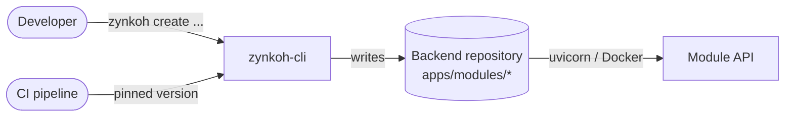
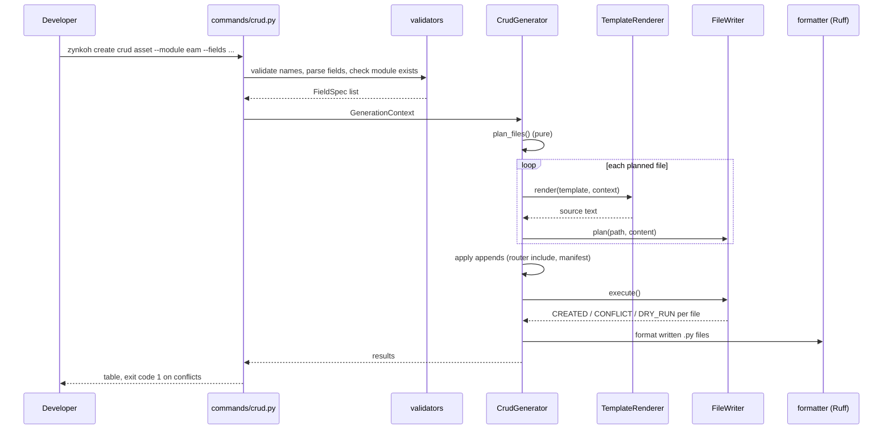
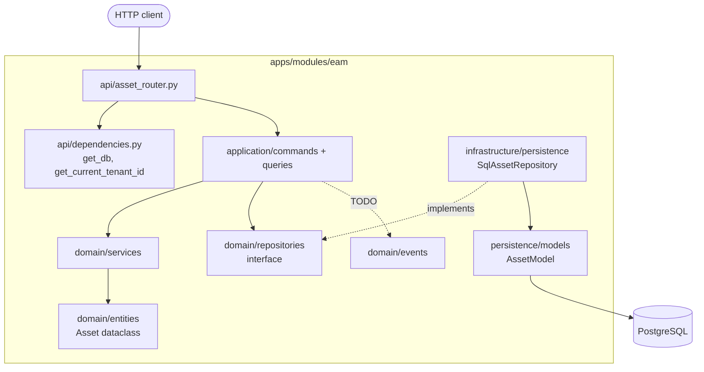
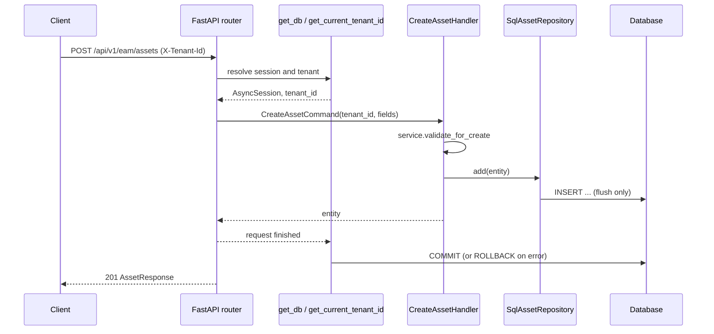

# zynkoh-cli Architecture

This document describes how the generator is built and the shape of the code it produces.

## 1. Context

A modular SaaS backend grows by adding bounded-context modules (EAM, HRMS, CRM, …) and,
inside them, resources. Hand-writing each resource repeats the same twenty-odd files, and
small inconsistencies between developers compound: a repository that forgets the tenant
filter, a filter endpoint that interpolates a column name, a money field stored as a float.
`zynkoh-cli` turns those conventions into templates so they are applied the same way every
time.

## 2. Internal layers

| Layer | Package | Responsibility | Side effects |
|---|---|---|---|
| CLI | `commands/` | Parse flags or prompt, call validators, build the context, run a generator, print results | Console only |
| Validation | `validators/` | Name rules, field grammar, module and entity existence | Reads the filesystem |
| Model | `models/` | `GenerationContext` (all naming variants), `ModuleManifest` (`module.yaml`) | None |
| Planning | `generators/` | `plan_files()`, `plan_extra_files()`, `plan_appends()` | None in `plan_*` |
| Rendering | `utils/renderer.py` | Jinja2 with `StrictUndefined`, so a missing variable fails loudly | None |
| Writing | `utils/file_writer.py` | Dry-run, conflict detection, `--force`, reporting | Writes files |
| Formatting | `utils/formatter.py` | Ruff import sorting and pyupgrade fixes on written files | Rewrites written `.py` files |

Exit codes matter for CI: conflicts and validation errors exit with status 1, so a pipeline
step that regenerates code fails instead of silently skipping files.

## 3. Generated module architecture

Dependencies point inwards: the domain layer imports nothing from FastAPI or SQLAlchemy, so
the business rules can move to a separate service unchanged.

### Request flow and transaction boundary

Repositories never commit. The request-scoped dependency owns the unit of work, so a
handler that touches two repositories commits or rolls back as one
([ADR-005](decisions/ADR-005-unit-of-work-in-request-dependency.md)).

### Safety properties of generated code

| Property | How it is enforced | Verified by |
|---|---|---|
| Tenant isolation | `tenant_id` in every repository signature and `WHERE` clause, including update/delete | `test_tenants_are_isolated` |
| No SQL injection via sort/filter | Allowlists generated from the field list; rejected values return 400 | `test_sort_field_must_be_on_the_allowlist` |
| Soft delete | `is_deleted = false` added to every read | `test_soft_delete_hides_entity_from_reads` |
| Correct money and date types | `Numeric(18, 4)` with `Decimal`; `Date` with `date` | `test_create_and_read_back_preserves_types` |
| Missing entities | `LookupError` from handlers mapped to 404 | `test_update_and_missing_entities_return_404` |
| Lint-clean output | Ruff post-format plus a generated `[tool.ruff]` config | `test_generated_code_passes_its_own_lint_rules` |

## 4. Extension points

- **New field type:** add it to the validator, then to the type maps in the entity, command, schema, persistence model and router templates (see [CONTRIBUTING.md](../CONTRIBUTING.md)).
- **New generator:** subclass `BaseGenerator`, implement `plan_files()`, add a command and register it in `commands/create.py`.
- **Breaking template change:** create `templates/v2/` and bump `generator_template_version`.

## 5. Trade-offs

| Choice | Benefit | Cost |
|---|---|---|
| Code generation instead of a runtime framework | Generated code is plain, readable and editable | Changes to conventions need regeneration or manual updates |
| Exact-match filters only | Simple, index-friendly, safe | Range and text search must be added by hand |
| Tenant scoping mandatory in v1 | Isolation cannot be forgotten | Single-tenant resources need hand-written code |
| Post-formatting with Ruff | Templates stay readable; output is lint-clean | Ruff is a runtime dependency of the CLI |
